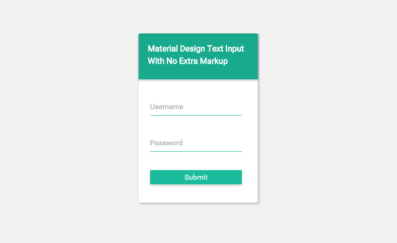

# html-css-startpoint

## Learn

1. Follow the [HTML & CSS](https://www.codecademy.com/learn/web) course.

## Prepare to work

1. Install [NodeJS](https://nodejs.org/en/) (if in doubt, pick a stable version).
1. In your console verify that it has been installed correctly (your versions may differ):
    ```
    $ node -v
    v5.1.1
    $ npm -v
    3.3.12
    ```
    If it does not work, try restarting the console or PC.
    
1. Install tools that will be necessery to develop your app.
    ```
    npm install -g gulp-cli
    ```
    NPM is a Node Package Manager (it is used to download stuff you are going to need, more or less). The command above installs [gulp](http://gulpjs.com/) globally so it is accessible in your command line. We will use it to facilitate our development process (you will see it in a while).
1. Fork this repository to your account.
1. Clone it to your desktop.
1. Go into the project's directory and execute `npm install`. It will download project's specific dependencies declared in `package.json` file (you can safely ignore this fact for now).

## Development

1. In the project's directory execute `gulp watch` command.
1. If everything goes somoothly, your browser should open a beautiful pink website. This is your project.
1. Try changing something in the `index.html` or `style.css` file. Notice your changes are instantly reflected in the browser.
1. When you finish the development, stop the `gulp watch` command with interrupt shortcut in the console (i.e. `Ctrl+C`).

## Task

Your goal is to make a beautiful login form like this one:


    
## Hints
1. We are developers. We often do not have an UX guy. This is why we love to use some predefined styles (aka CSS frameworks) to make our applications look beautiful. This is why you should not write your own CSS for this task but rather use a [materialize-css](http://materializecss.com/) framework.
  1. Install the framework with NPM (there is an info about it in the Getting Started)
  1. Link Materialize's CSS files to your page.
  1. Browse Materialize's CSS and components on their page and find something useful for your login form.
1. You might need to add some extra CSS styles to your page to set a background, position the element etc.
1. Commit your work after each logical step (i.e. "Add Materialize CSS", "Change bg from pink to white" etc). If you are comfortable enough, try working with local branches.

## Bonus

Try adding [some icons](http://materializecss.com/icons.html) for username & password input and button.
